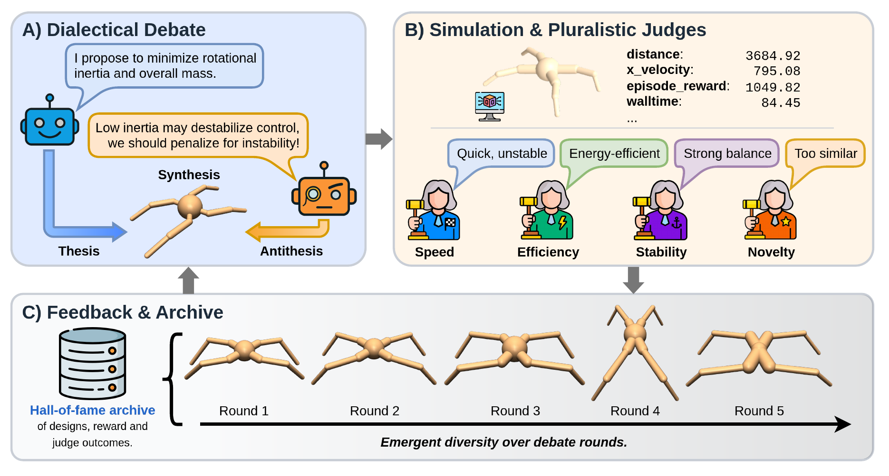

# Debate2Create: Robot Co-design via Multi-Agent LLM Debate

[](https://arxiv.org/abs/2510.25850)
[](https://debate2create.github.io/)
[](https://github.com/kevinxqiu/debate2create/actions/workflows/smoke.yml)
[](LICENSE)
[](https://www.python.org/)
[](https://arxiv.org/abs/2510.25850)
[](https://docs.astral.sh/ruff/)

**Debate2Create** is a research codebase for co-optimizing robot morphology and
control with multi-agent LLM debate. Design agents propose MuJoCo XML edits,
control agents write reward functions, judge agents critique the candidates, and
the resulting robots are evaluated with reinforcement learning in Brax/MuJoCo
locomotion environments.

<p align="center">
  
</p>
<p align="center"><i>Overview of the Debate2Create framework: agents debate, synthesize, train, and evaluate candidate robot designs and rewards.</i></p>

## Highlights

- Jointly proposes robot morphologies and reward functions instead of treating
  body design and control design as separate problems.
- Uses multi-agent debate to critique and revise candidate XML/reward pairs
  before reinforcement-learning evaluation.
- Trains candidates with PPO or SAC in Brax/MuJoCo and compares methods with a
  shared simulator score.
- Includes robot assets, Hydra configs, command-line utilities, and CPU smoke
  tests for Ant, HalfCheetah, Hopper, Swimmer, and Walker2d.

## Installation

Use Python 3.10 from the repository root:

```bash
python3.10 -m venv .venv
source .venv/bin/activate
python -m pip install --upgrade pip
python -m pip install -r requirements.txt
python -m pip install -e . --no-deps
```

## Quick Start

Run the local CPU smoke tests:

```bash
PYTHONPATH=src:. JAX_PLATFORM_NAME=cpu MUJOCO_GL=disable \
  python -m unittest discover -s tests
```

Run the full local preflight:

```bash
scripts/preflight.sh
```

Render one included D2C design/reward pair without calling an LLM or training a
policy:

```bash
PYTHONPATH=src:. JAX_PLATFORM_NAME=cpu MUJOCO_GL=disable \
  d2c-render --xml baselines/swimmer/d2c/swimmer_modified.xml \
  --reward baselines/swimmer/d2c/reward_id0.py --env-name swimmer \
  --steps 5 --out outputs/readme_swimmer_static.html
```

GPU training requires a CUDA-enabled JAX/JAXLIB installation matching your
machine. For local headless CPU checks, use `MUJOCO_GL=disable`; for rendering
or GPU execution, choose the MuJoCo GL backend appropriate for the system.

## Configuration

The main Hydra config is `cfg/config.yaml`. Select an environment with
`env=<name>`:

```bash
PYTHONPATH=src:. python src/debate.py --help
```

LLM-backed runs require an API key for the selected provider:

```bash
export OPENAI_API_KEY=...
# or, for Gemini-backed agents:
export GEMINI_API_KEY=...
```

Provider selection is controlled by `LLM_PROVIDER` or by choosing a model name
with a provider-specific prefix, such as `model=gemini-2.5-pro`. For Gemini,
`GOOGLE_API_KEY` is also accepted as a compatibility alias, but set only one of
`GEMINI_API_KEY` or `GOOGLE_API_KEY`.

Weights & Biases logging is off by default in `cfg/config.yaml`. To force
offline behavior in shared environments:

```bash
export WANDB_MODE=disabled
```

A small functionality check on Hopper:

```bash
OPENAI_API_KEY=... PYTHONPATH=src:. python src/debate.py env=hopper \
  debate.rounds=1 sample=1 design_sample=1 debate.enable_judges=false \
  rl.envs.hopper.sac.num_timesteps=10000
```

The timestep override is only a smoke setting; use larger training budgets for
meaningful policies.

## Useful Entry Points

```bash
PYTHONPATH=src:. python scripts/train_xml_reward.py --help
PYTHONPATH=src:. python scripts/render_xml_reward.py --help
d2c-debate --help
d2c-train-xml --help
d2c-render --help
```

- `src/debate.py`: main Hydra entry point for Debate2Create.
- `scripts/train_xml_reward.py`: train a policy for a specific XML and reward.
- `scripts/render_xml_reward.py`: train and render an XML/reward pair.

Reward files are Python code and are executed locally when compiled. Review
LLM-generated or third-party reward files before running training or rendering
commands against them.

## Outputs

Runtime outputs should go under ignored directories such as `outputs/`, `runs/`,
or `logs/`. A typical debate run writes one directory per round:

```text
outputs/debate/<timestamp>/debate_runs/
  config.yaml
  exchange_history.json
  round_000/
    feedback_context.txt
    round_exchange.json
    reward_scores_cand00.json
    thesis_00/
      critique.txt
      design_thesis.json
      <env>_modified.xml
      prompts/
    synthesis_00/
      critique.txt
      design_synthesis.json
      <env>_modified.xml
      reward_id0.py
      train_metrics_0.json
      persona_feedback/
      prompts/
```

## Project Structure

```text
assets/       MuJoCo XML robot assets
baselines/    Reference XML/reward assets and benchmark utilities
cfg/          Hydra configuration
docs/         Additional documentation and README figures
envs/         Brax environment definitions
scripts/      Training, rendering, and analysis utilities
src/          Debate, design, training, judging, and rendering code
tests/        CPU smoke tests
utils/        LLM, reward, XML, prompt, and filesystem utilities
```

## Citation

If you use Debate2Create in your research, please cite:

```bibtex
@inproceedings{qiu2026debate2create,
  title={Debate2Create: Robot Co-design via Multi-Agent {LLM} Debate},
  author={Qiu, Kevin and Cygan, Marek},
  booktitle={Proceedings of the International Conference on Machine Learning (ICML)},
  year={2026},
  note={To appear}
}
```

## License

This project is licensed under the Apache License 2.0. See [LICENSE](LICENSE)
for details. Third-party code and asset attributions are listed in
[THIRD_PARTY_NOTICES.md](THIRD_PARTY_NOTICES.md).
